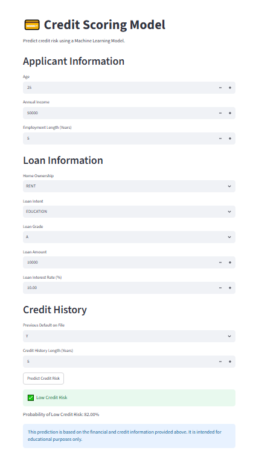

# Credit Scoring Model

A machine learning project that predicts an individual's credit risk using personal, financial, and loan-related information.

This project was developed as part of my Machine Learning Internship at CodeAlpha.

The project follows a complete machine learning workflow:

Raw Data → Exploratory Data Analysis → Data Cleaning → Preprocessing → Model Training → Evaluation → Streamlit Application

---

## Project Objective

The objective of this project is to predict whether a loan applicant is likely to default based on their financial and personal information.

This is a supervised machine learning classification problem.

The target variable is:

* `loan_status = 0` → No default
* `loan_status = 1` → Default

---

## Dataset

The dataset contains information about loan applicants and their credit-related characteristics.

### Dataset Size

* Original rows: 32,581
* Original columns: 12
* Final processed rows: 32,416
* Final processed columns: 26

### Main Features

The dataset includes information such as:

* Applicant age
* Annual income
* Employment length
* Home ownership
* Loan intent
* Loan grade
* Loan amount
* Interest rate
* Loan-to-income ratio
* Previous default history
* Credit history length

---

## Exploratory Data Analysis

During exploratory data analysis, the following observations were identified:

* The dataset initially contained 32,581 rows and 12 columns.
* Missing values were found in `person_emp_length` and `loan_int_rate`.
* The dataset contained 165 duplicate rows.
* The target variable was imbalanced:

  * Class 0: 78.2%
  * Class 1: 21.8%
* A strong correlation of 0.86 was found between `person_age` and `cb_person_cred_hist_length`.
* Several numerical features showed right-skewed distributions.
* Potential outliers were identified in features such as age, employment length, and income.
* `loan_percent_income` and `loan_int_rate` showed strong positive relationships with the target variable.

---

## Data Cleaning and Preprocessing

The following preprocessing steps were performed.

### Missing Values

For `person_emp_length`, missing values were replaced using the median value because the feature contained extreme values and was right-skewed.

For `loan_int_rate`, missing values were imputed using the median interest rate for each `loan_grade`.

This approach preserved the relationship between loan grade and interest rate.

### Duplicate Removal

The dataset initially contained 165 duplicate rows.

These duplicate records were removed.

Final dataset after duplicate removal:

32,416 rows × 12 columns

### Unrealistic Values

Several unrealistic values were identified.

Examples included:

* Age values above 100 years
* Employment lengths of 123 years

These invalid values were converted to missing values and replaced with the median of their respective features.

Final maximum values:

* Maximum age: 94 years
* Maximum employment length: 41 years

### Categorical Encoding

The following transformations were applied.

#### Binary Encoding

`cb_person_default_on_file`

Y → 1

N → 0

#### One-Hot Encoding

The following categorical variables were one-hot encoded:

* `person_home_ownership`
* `loan_intent`
* `loan_grade`

The processed dataset contained 26 columns.

### Feature and Target Separation

The target variable was:

`loan_status`

The data was separated into:

X → Features

y → Target

Final dimensions:

X → 32,416 rows × 25 features

y → 32,416 rows

### Train-Test Split

The dataset was split into:

* 80% training data
* 20% testing data

Stratified sampling was used to preserve the original class distribution.

Final split:

Training set: 25,932 rows

Testing set: 6,484 rows

---

## Machine Learning Models

Three classification algorithms were trained and evaluated:

### 1. Logistic Regression

A linear classification algorithm used as a baseline model.

### 2. Decision Tree

A tree-based model capable of learning non-linear relationships.

### 3. Random Forest

An ensemble model consisting of multiple decision trees.

Random Forest achieved the best overall performance and was selected for the Streamlit application.

---

## Model Performance

The models were evaluated using:

* Accuracy
* Precision
* Recall
* F1-Score
* ROC-AUC

### Model Comparison

| Model               | Accuracy | ROC-AUC |
| ------------------- | -------: | ------: |
| Logistic Regression |   86.84% |  0.8680 |
| Decision Tree       |   88.82% |  0.8482 |
| Random Forest       |   93.41% |  0.9293 |

### Best Model

Random Forest achieved the best overall performance:

* Accuracy: 93.41%
* ROC-AUC: 0.9293

Therefore, the Random Forest model was selected for the Streamlit application.

---

## Random Forest Classification Report

| Class   | Precision | Recall | F1-Score |
| ------- | --------: | -----: | -------: |
| Class 0 |      0.93 |   0.99 |     0.96 |
| Class 1 |      0.97 |   0.72 |     0.83 |

The model achieved strong performance on both classes.

However, the recall for Class 1 indicates that some default cases were not identified by the model.

---

## Confusion Matrix

The Random Forest confusion matrix produced the following results:

| Actual / Predicted | Class 0 | Class 1 |
| ------------------ | ------: | ------: |
| Class 0            |   5,033 |      33 |
| Class 1            |     394 |   1,024 |

This means:

* True Negatives: 5,033
* False Positives: 33
* False Negatives: 394
* True Positives: 1,024

---

## Streamlit Application

The project includes an interactive Streamlit application.

Users can enter information about a loan applicant, including:

* Age
* Annual income
* Employment length
* Home ownership
* Loan intent
* Loan grade
* Loan amount
* Interest rate
* Previous default history
* Credit history length

The application then:

1. Collects the user's input.
2. Calculates the `loan_percent_income` feature.
3. Encodes categorical variables.
4. Creates the same 25 features used during model training.
5. Uses the trained Random Forest model.
6. Predicts the applicant's credit risk.
7. Displays the prediction probability.

### Run the Application

Clone the repository:

git clone [https://github.com/alirazasaleem-1/CodeAlpha_CreditScoringModel.git](https://github.com/alirazasaleem-1/CodeAlpha_CreditScoringModel.git)

Navigate to the project directory:

cd CodeAlpha_CreditScoringModel

Create a virtual environment:

python -m venv .venv

Activate the virtual environment on Windows:

.venv\Scripts\activate

Install the required dependencies:

pip install -r requirements.txt

Run the Streamlit application:

streamlit run app/app.py

---

## Application Preview

---

## Project Structure

CodeAlpha_CreditScoringModel/
│
├── app/
│   └── app.py
│
├── data/
│   ├── raw/
│   │   └── credit_data.csv
│   │
│   └── processed/
│       └── cleaned_credit_data.csv
│
├── images/
│   └── streamlit_app.png
│
├── models/
│   ├── decision_tree_model.pkl
│   ├── logistic_regression_model.pkl
│   ├── random_forest_model.pkl
│   └── standard_scaler.pkl
│
├── notebooks/
│   └── Credit_Scoring_Model.ipynb
│
├── reports/
│   └── model_comparison.csv
│
├── src/
│
├── .gitignore
├── LICENSE
├── README.md
└── requirements.txt

---

## Technologies Used

* Python
* Pandas
* NumPy
* Matplotlib
* Seaborn
* Scikit-learn
* Joblib
* Jupyter Notebook
* Streamlit
* Git
* GitHub

---

## Limitations

* The model's performance depends on the quality and distribution of the dataset.
* The dataset may not represent all real-world borrowers.
* The model may produce false positives and false negatives.
* The dataset contains an imbalanced target variable.
* The application is intended for educational purposes and should not be used as a real financial decision-making system.
* The current application uses a trained model without real-time financial data.

---

## Future Improvements

Possible future improvements include:

* Deploying the Streamlit application online.
* Hyperparameter tuning for improved model performance.
* Exploring additional machine learning algorithms.
* Applying techniques to address class imbalance.
* Adding explainable AI features.
* Building a complete preprocessing pipeline.
* Adding automated data validation.
* Improving the user interface.
* Adding model monitoring and performance tracking.

---

## Key Learning Outcomes

Through this project, I practiced:

* Understanding a real-world machine learning problem.
* Performing exploratory data analysis.
* Handling missing values.
* Removing duplicate records.
* Detecting and correcting unrealistic values.
* Encoding categorical variables.
* Splitting data using stratified sampling.
* Training multiple classification models.
* Evaluating models using multiple metrics.
* Interpreting confusion matrices.
* Comparing model performance.
* Saving trained machine learning models.
* Building a Streamlit machine learning application.
* Connecting a trained model to a user-facing interface.

---

## Disclaimer

This project was created for educational and learning purposes as part of a Machine Learning Internship.

The predictions generated by this application should not be used as a substitute for professional financial or credit decisions.

---

## Author

Ali Raza Saleem

BS Computer Science Student

Machine Learning Intern at CodeAlpha

GitHub: [https://github.com/alirazasaleem-1](https://github.com/alirazasaleem-1)